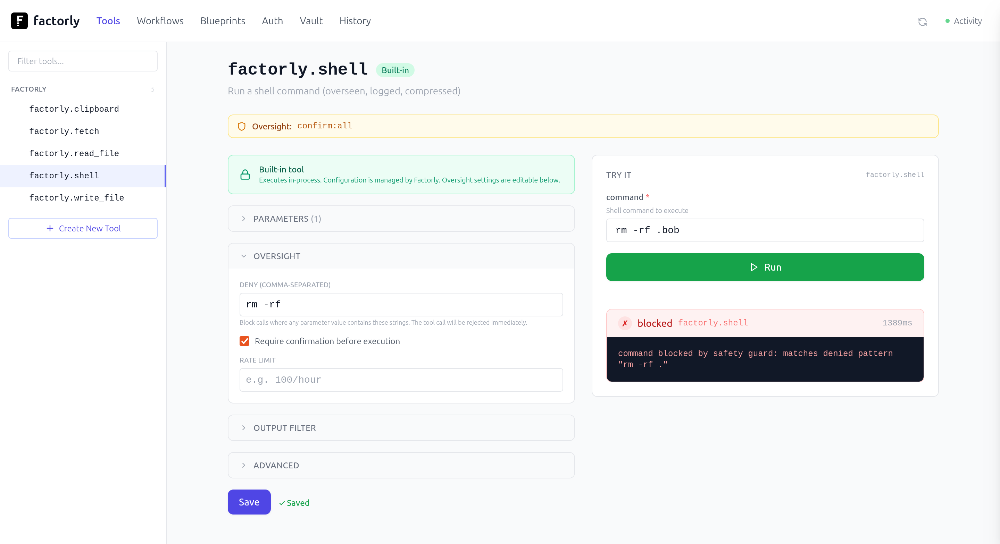

```
░█▀▀░█▀█░█▀▀░▀█▀░█▀█░█▀▄░█░░█░█
░█▀▀░█▀█░█░░░░█░░█░█░█▀▄░█░░░█░
░▀░░░▀░▀░▀▀▀░░▀░░▀▀▀░▀░▀░▀▀▀░▀░
```

<center>

# Factorly

[](https://github.com/factorly-dev/factorly/releases)
[](https://go.dev)
[](LICENSE)
[](https://github.com/factorly-dev/factorly/actions/workflows/ci.yml)
[](https://www.npmjs.com/package/factorly)
[](https://pypi.org/project/factorly/)
[](https://modelcontextprotocol.io)
[](docs/)

**Build what your agent can do.**

Define tools, compose workflows, test and run them.
MCP servers, REST APIs, and CLI commands in one config, one UI, one audit log.

</center>

Factorly is a local runtime for agent tool chains. It manages tool calls, injects credentials from an encrypted vault, enforces governance rules, and logs everything. Your agent sees workflows, tools, and data. Secrets stay secret.



---


## Install

Install with your package manager of choice:

```bash
brew install factorly-dev/tap/factorly
  # or: npm install -g factorly
  # or: pip install factorly
  # or: go install github.com/factorly-dev/factorly@latest
```

## Quick Start

Then, define your tools, secure your credentials, and sync with your agent:

```bash
# 1. Configure your tools or install a blueprint (41 services: GitHub, Slack, Stripe, Linear, Gmail, ...)
factorly init
factorly blueprint install github

# 2. Store your credentials in the encrypted vault
factorly vault set GITHUB_TOKEN ghp_xxxxxxxxxxxx

# 3. Connect to your agent (auto-detects Claude Code, Cursor, Codex)
factorly sync

# 3. Optional, start the UI
factorly ui
```

Your agent connects to Factorly as a single MCP server or CLI and sees every tool you've configured. Credentials never leave the vault.

---

## What It Does

**Define** — one config, every protocol, [40+ blueprints](docs/blueprints.md) included

**Test** — Try tools in the [UI](docs/ui.md), see the response, iterate before giving your agent access

**Compose** — [workflows](docs/workflows.md) with per-step policies, deterministic sequences

**Govern** — [vault](docs/vault.md), [policies](docs/examples/10-deny-dangerous-operations.md), [audit log](docs/logging.md). Built in, not bolted on.

```
┌────────────┐       ┌────────────┐       ┌────────────┐
│            │       │            │       │            │
│ Your Agent │──────▶│  Factorly  │──────▶│ Your Tools │
│            │       │            │       │            │
└────────────┘       └────────────┘       └────────────┘
  Sees:                Vault               REST APIs
  - tool names         Governance          CLI commands
  - workflows          Audit log           MCP servers
  - data               Rate limits

  Never sees:
  - API keys
  - tokens
  - credentials
```

---

## Docs

- [Getting Started](docs/getting-started.md)
- [Configuration](docs/config-reference.md)
- [CLI Reference](docs/cli-reference.md)
- [Web UI](docs/ui.md)
- [Workflows](docs/workflows.md)
- [Expressions](docs/expressions.md)
- [Output Filters](docs/filters.md)
- [Blueprints](docs/blueprints.md)
- [Vault](docs/vault.md)
- [OAuth](docs/oauth.md)
- [Logging](docs/logging.md)
- [OpenAPI Import](docs/openapi-import.md)
- [Examples](docs/examples/)

## License

[GPL-3.0](LICENSE)
