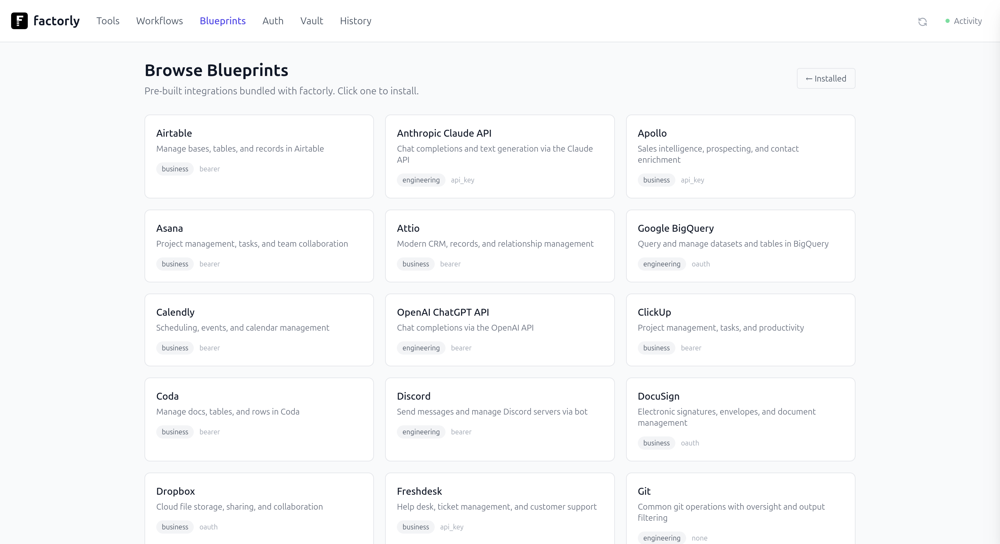

# Web UI

Factorly includes a built-in web interface for browsing, testing, and managing your tools.

```bash
factorly ui
```




## What you can do

- **Browse tools** — see all configured tools grouped by prefix, with type badges (CLI, REST, MCP, Built-in, Workflow)
- **Try It** — execute any tool from the browser with a form for parameters, view JSON responses with collapsible tree, copy output
- **Edit tools** — modify configuration, parameters, oversight, and output filters inline
- **Workflows** — visual step editor with conditional logic, variable passing, and per-step tool selection
- **Confirm prompts** — approve or deny shadow confirm prompts from the browser (works alongside MCP elicitation)
- **Vault** — manage encrypted credentials without touching the CLI
- **Auth** — configure and refresh OAuth providers
- **Activity feed** — live SSE stream of all tool calls as they happen
- **Import** — import tools from OpenAPI specs, or install blueprints from the bundled catalog / GitHub URL / pasted YAML

## Options

```bash
factorly ui [flags]
  --port int        Port to serve on (default 4100)
  --host string     Host to bind to (default "127.0.0.1")
  --no-launch       Don't open the browser automatically
  --mcp             Enable MCP endpoint on the same server
  --mcp-token       Bearer token for MCP endpoint authentication
```

## Security

- **Per-run nonce token** — a random token is generated on each launch, stored in an HttpOnly cookie (SameSite=Strict)
- **Host validation** — only accepts requests from localhost/127.0.0.1
- **Local development only** — a warning is shown if bound to a non-localhost address
- **Confirm timeout** — unresponded prompts auto-deny after 60 seconds

## Confirm prompts

When a tool has `shadow.confirm: true`, the UI shows a modal with tool name and parameters. You can approve or deny from the browser.

If an MCP agent is also connected, both the browser and the agent see the prompt — first response wins.

Prompts are delivered via SSE with a polling fallback (every 2s) for reliability.

## MCP co-hosting

With `--mcp`, the UI server also exposes an MCP endpoint at `/mcp`. Your agent connects to one URL for both the tool API and the browser interface.

```bash
factorly ui --mcp --mcp-token "{{vault:MCP_TOKEN}}"
```

---

[← Back to Docs](README.md)
